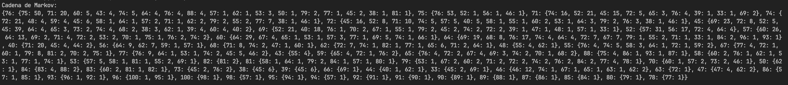
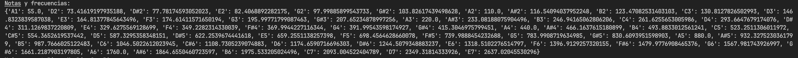

### Explicación de las partes más importantes

1. La cadena de Markov se construye a partir de las notas extraídas del archivo MIDI. Se crea un diccionario markov_chain donde las claves son las notas actuales y los valores son diccionarios que mapean las siguientes notas y su conteo.



2. La matriz de transición "transition_matrix" se construye a partir de la cadena de Markov. Cada elemento de la matriz representa la probabilidad de transición de una nota a otra. La probabilidad se calcula dividiendo el conteo de transiciones de una nota a otra por el total de transiciones desde esa nota.



3. Se imprimen las probabilidades de transición para cada nota, mostrando la nota actual y las siguientes notas posibles junto con sus probabilidades.

[[ 0.00000  0.00000  0.00000  0.00000  0.00000  0.00000  0.66667  0.00000
   0.00000  0.00000  0.00000  0.00000  0.00000  0.00000  0.00000  0.00000
   0.00000  0.00000  0.00000  0.00000  0.00000  0.00000  0.00000  0.00000
   0.00000  0.00000  0.33333  0.00000  0.00000  0.00000  0.00000  0.00000
   0.00000  0.00000  0.00000  0.00000  0.00000  0.00000  0.00000  0.00000
   0.00000  0.00000  0.00000  0.00000  0.00000  0.00000  0.00000  0.00000
   0.00000  0.00000  0.00000  0.00000  0.00000  0.00000  0.00000  0.00000]
 [ 0.00000  0.00000  0.00000  0.00000  0.00000  0.00000  1.00000  0.00000
   0.00000  0.00000  0.00000  0.00000  0.00000  0.00000  0.00000  0.00000
   0.00000  0.00000  0.00000  0.00000  0.00000  0.00000  0.00000  0.00000
   0.00000  0.00000  0.00000  0.00000  0.00000  0.00000  0.00000  0.00000
   0.00000  0.00000  0.00000  0.00000  0.00000  0.00000  0.00000  0.00000
   0.00000  0.00000  0.00000  0.00000  0.00000  0.00000  0.00000  0.00000
   0.00000  0.00000  0.00000  0.00000  0.00000  0.00000  0.00000  0.00000]
 [ 0.00000  0.00000  0.00000  0.00000  0.00000  0.00000  1.00000  0.00000
   0.00000  0.00000  0.00000  0.00000  0.00000  0.00000  0.00000  0.00000
   0.00000  0.00000  0.00000  0.00000  0.00000  0.00000  0.00000  0.00000
   0.00000  0.00000  0.00000  0.00000  0.00000  0.00000  0.00000  0.00000
   0.00000  0.00000  0.00000  0.00000  0.00000  0.00000  0.00000  0.00000
   0.00000  0.00000  0.00000  0.00000  0.00000  0.00000  0.00000  0.00000
   0.00000  0.00000  0.00000  0.00000  0.00000  0.00000  0.00000  0.00000]
 [ 0.00000  0.00000  0.00000  0.00000  0.00000  0.07692  0.15385  0.00000
   0.00000  0.00000  0.00000  0.00000  0.00000  0.00000  0.00000  0.00000
   0.00000  0.00000  0.00000  0.00000  0.00000  0.00000  0.00000  0.00000
   0.00000  0.00000  0.00000  0.00000  0.76923  0.00000  0.00000  0.00000
   0.00000  0.00000  0.00000  0.00000  0.00000  0.00000  0.00000  0.00000
   0.00000  0.00000  0.00000  0.00000  0.00000  0.00000  0.00000  0.00000
   0.00000  0.00000  0.00000  0.00000  0.00000  0.00000  0.00000  0.00000]
    ...]

4. En la función generador_melodias, se selecciona una nota inicial aleatoria y se genera un tono correspondiente. Luego, para cada transición, se selecciona la siguiente nota utilizando las probabilidades de transición de la matriz transition_matrix. La selección de la siguiente nota se realiza utilizando np.random.choice con las probabilidades especificadas en la fila correspondiente a la nota actual en la matriz de transición.

    La función np.random.choice en NumPy se utiliza para generar muestras aleatorias a partir de un objeto similar a un array o una distribución de probabilidad discreta. Cuando se utiliza en relación con una matriz de transición, np.random.choice permite seleccionar el siguiente estado o evento basándose en las probabilidades definidas en la matriz de transición.

    En el contexto de una matriz de transición, cada fila de la matriz representa la distribución de probabilidad de transitar de un estado a otro. Los valores en cada fila suman 1, representando la probabilidad total de transitar desde ese estado a cualquier otro estado.

    Así es como funciona np.random.choice con una matriz de transición:

    1. La función toma los siguientes argumentos principales:

    a: El objeto similar a un array o la lista de posibles resultados (estados) de los cuales elegir.

    p: La distribución de probabilidad asociada con cada resultado (estado) en a. Si no se proporciona, se asume que los resultados tienen igual probabilidad.

    2. Al usar una matriz de transición, generalmente se pasa la lista de estados posibles como el argumento a y la fila correspondiente de la matriz de transición como el argumento p.

    3. np.random.choice luego selecciona el siguiente estado aleatoriamente basándose en la distribución de probabilidad proporcionada. Hace esto generando un número aleatorio entre 0 y 1 y usándolo para determinar qué estado elegir basándose en las probabilidades acumulativas de los estados.

    4. El estado seleccionado se devuelve como la salida de np.random.choice y se utiliza como el siguiente estado en la secuencia de eventos.

    Cuando se utiliza np.random.choice con una matriz de transición, la función selecciona el siguiente estado basándose en la distribución de probabilidad especificada en la fila correspondiente. Si algunos valores en esa fila son 0, np.random.choice asignará automáticamente una probabilidad de 0 a los estados correspondientes y solo considerará los estados con probabilidades distintas de cero para la selección.

    Aquí hay un ejemplo para ilustrar cómo np.random.choice maneja las probabilidades de 0:

    ```python
    import numpy as np

    # Matriz de transición con algunas probabilidades como 0
    transition_matrix = np.array([
        [0.6, 0.4, 0.0],
        [0.2, 0.8, 0.0],
        [0.3, 0.0, 0.7]
    ])

    # Estados posibles
    states = ['A', 'B', 'C']

    # Estado actual
    current_state = 'A'

    # Seleccionar el siguiente estado basándose en las probabilidades de transición
    current_index = states.index(current_state)
    next_state = np.random.choice(states, p=transition_matrix[current_index])

    print("Estado actual:", current_state)
    print("Siguiente estado:", next_state)

    ```

    En este ejemplo, la matriz de transición tiene algunas probabilidades de transición como 0. Cuando el estado actual es 'A', las probabilidades de transición son [0.6, 0.4, 0.0], lo que significa que hay una probabilidad de 0.6 de permanecer en el estado 'A', una probabilidad de 0.4 de transitar al estado 'B' y una probabilidad de 0 de transitar al estado 'C'.

    Al llamar a np.random.choice(states, p=transition_matrix[current_index]), la función seleccionará el siguiente estado basándose en la distribución de probabilidad [0.6, 0.4, 0.0]. Internamente, np.random.choice normalizará las probabilidades distintas de cero para que sumen 1 y luego seleccionará el siguiente estado basándose en esa distribución normalizada.

    En este caso, np.random.choice solo considerará los estados 'A' y 'B' para la selección, ya que tienen probabilidades distintas de cero. El estado 'C' tiene una probabilidad de 0 y, por lo tanto, nunca será seleccionado.

    Entonces, np.random.choice se asegura automáticamente de seleccionar un estado con una probabilidad mayor que 0 al ignorar los estados con probabilidades de 0 y normalizar las probabilidades restantes.


5. Se genera una melodía con un número específico de transiciones (number_of_transitions) utilizando la función generador_melodias.